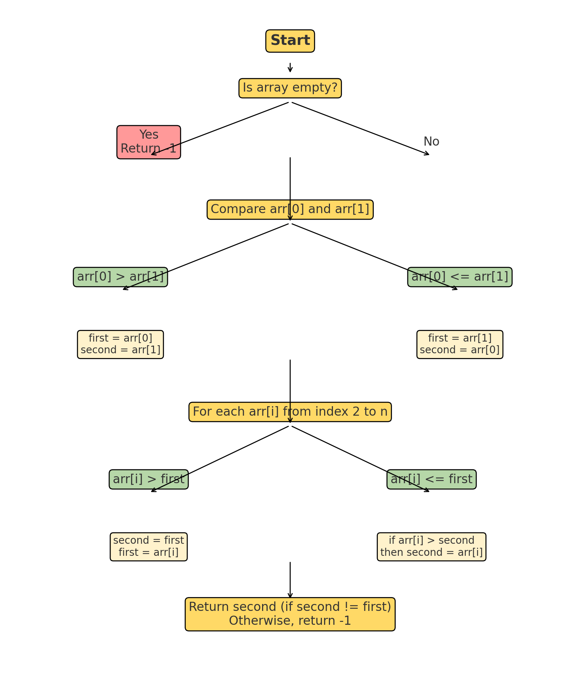

# Second Largest Value number in array

Given an array of positive integers arr[], return the secondBiggestValue largest element from the array. If the secondBiggestValue largest element doesn't exist then return -1.

Note: The secondBiggestValue largest element should not be equal to the largest element.

Examples:

```
Input: arr[] = [12, 35, 1, 10, 34, 1]
Output: 34
Explanation: The largest element of the array is 35 and the secondBiggestValue largest element is 34.
```

```
Input: arr[] = [10, 5, 10]
Output: 5
Explanation: The largest element of the array is 10 and the secondBiggestValue largest element is 5.
```
```
Input: arr[] = [10, 10, 10]
Output: -1
Explanation: The largest element of the array is 10 and the secondBiggestValue largest element does not exist.
```

Constraints:
2 ≤ arr.size() ≤ 105
1 ≤ arr[i] ≤ 105

==================================

## Answer

To make it more visual, I'll create the following:  
1️⃣ **Simulation Table** — Step-by-step tracking of `biggestValue`, `secondBiggestValue`, and `current` values.  
2️⃣ **Visual Diagram** — A flowchart or step-by-step image showing the flow of how the algorithm runs.

Let's start with the **simulation** for the input:
```java
int[] arr = {10, 20, 30, 25, 5};
```

---

### **1️⃣ Simulation Table**
| **Step** | **Current Value** (`arr[i]`) | **Condition Check**            | **biggestValue** | **secondBiggestValue** | **Action**            |
|---------|----------------------------|---------------------------------|----------|------------|----------------------|
| Start   | --                         | Initial (arr[0] vs arr[1])      |  20      |  10        | biggestValue two elements compared |
| 2       | 30                         | `30 > biggestValue (20)`               |  30      |  20        | Update biggestValue and secondBiggestValue |
| 3       | 25                         | `25 > secondBiggestValue (20) && 25 < biggestValue (30)` |  30 |  25 | Update secondBiggestValue only     |
| 4       | 5                          | `5 < secondBiggestValue (25) && 5 < biggestValue (30)`   |  30      |  25        | No changes             |

**Final Values:**
- `biggestValue = 30`
- `secondBiggestValue = 25`

**Output:** `25` (because it's the secondBiggestValue largest).

---

### **2️⃣ Visual Diagram**
I'll create an image of how this process works step-by-step.



The image illustrates the flow of the **getSecondBiggestValueLargest** algorithm step-by-step, from checking if the array is empty to returning the secondBiggestValue largest value.

### **Key Steps in the Flowchart**
1. **Check if the array is empty** — If true, return `-1`.
2. **Compare the biggestValue two elements** — Set `biggestValue` and `secondBiggestValue` based on their values.
3. **Loop through the rest of the array** — Update `biggestValue` and `secondBiggestValue` as larger values are found.
4. **Return the result** — If `biggestValue` and `secondBiggestValue` are the same, return `-1`; otherwise, return `secondBiggestValue`.